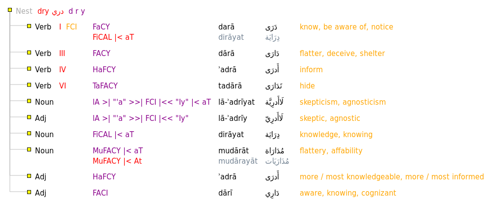
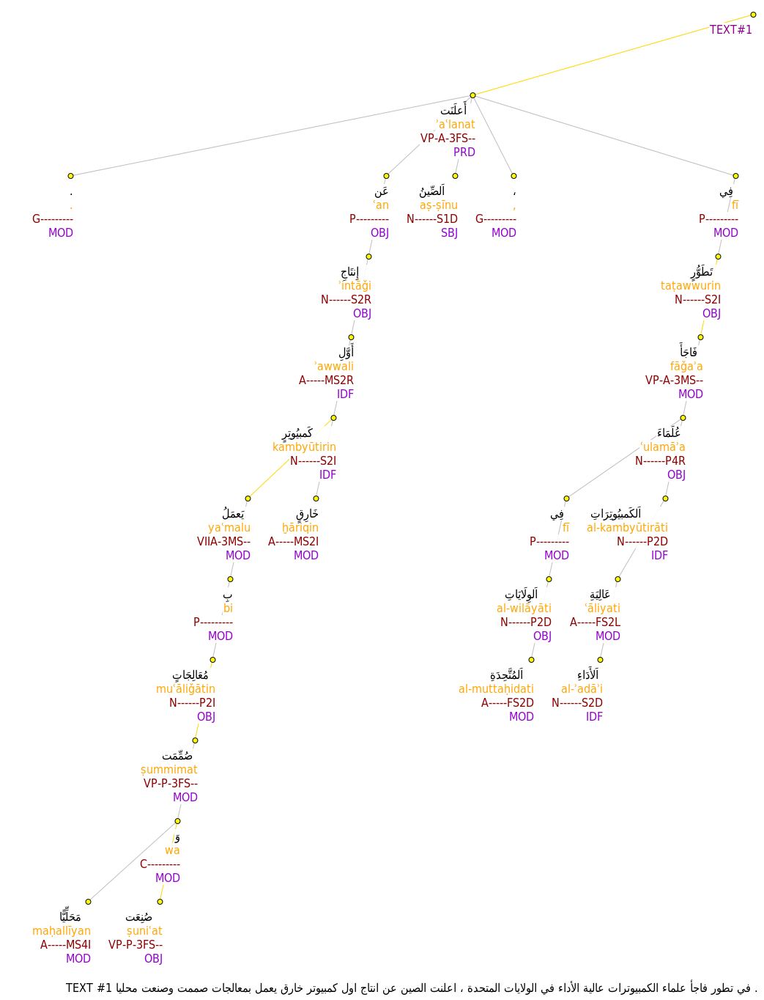

# ElixirFM

[http://github.com/otakar-smrz/elixir-fm](http://github.com/otakar-smrz/elixir-fm)

[http://otakar-smrz.github.io/elixir-fm](http://otakar-smrz.github.io/elixir-fm)

## New things

- ElixirFM now uses [Jupyter](http://jupyter.org) to provide example-driven insights and documentation. Check out the [IHaskell](Haskell/ElixirFM/README.ipynb), [IPython](Python/ElixirFM/README.ipynb), [IPerl](Perl/ElixirFM/README.ipynb), and [IShell](README.ipynb) notebooks!

- The [Haskell](Haskell/ElixirFM) library and executable pretty-print the output of the [resolve](Haskell/ElixirFM/Elixir/Resolve.hs), [inflect](Haskell/ElixirFM/Elixir/Inflect.hs), [derive](Haskell/ElixirFM/Elixir/Derive.hs), [lookup](Haskell/ElixirFM/Elixir/Lookup.hs), and [merge](Haskell/ElixirFM/Elixir/Template.hs) modes in a column-oriented format for both clarity and convenient processing. You can `cut` or `grep` the information on the [command line](README.ipynb) as well as [unpretty](Python/ElixirFM/README.ipynb) the output into nested data structures using [Python](Python/ElixirFM/ElixirFM/__init__.py) or [Perl](Perl/ElixirFM/lib/ElixirFM.pm).

- The ElixirFM [lexicon](Haskell/ElixirFM/Elixir/Lexicon.hs) gets incrementally improved. In order to boost the coverage of the resolve, lookup, and inflect modes, the derive mode is applied automatically on the lexicon and verbal entries generate their masdars and active and passive participles. Check out our [web service](http://otakar-smrz.github.io/elixir-fm), in any case.

- The [elixir](TrEd/elixir) extension for [TrEd](TrEd) provides a customizable development environment for editing the [lexicon](TrEd/elixir/data). The [aqmar](TrEd/aqmar) extension shows how ElixirFM can be integrated with annotating [morphology](TrEd/aqmar/data/example.aqmar.morpho.png) and [syntax](TrEd/aqmar/data/example.aqmar.syntax.png) in linguistic data.

## Join us

Since [ElixirFM](http://github.com/otakar-smrz/elixir-fm) is now hosted on [GitHub](http://github.com/otakar-smrz), it becomes yet easier to join the project and contribute to it. We do need new features, applications, interfaces, and documentation. Feel free to [contact us](http://github.com/otakar-smrz/elixir-fm/issues) or clone the project!
